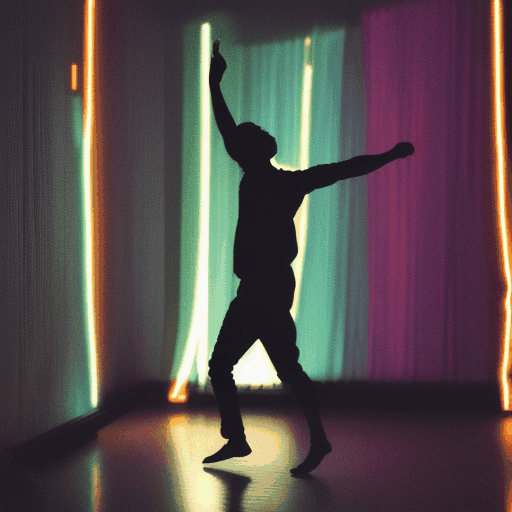
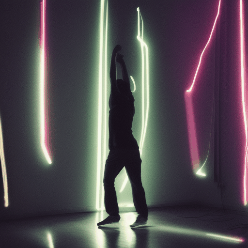
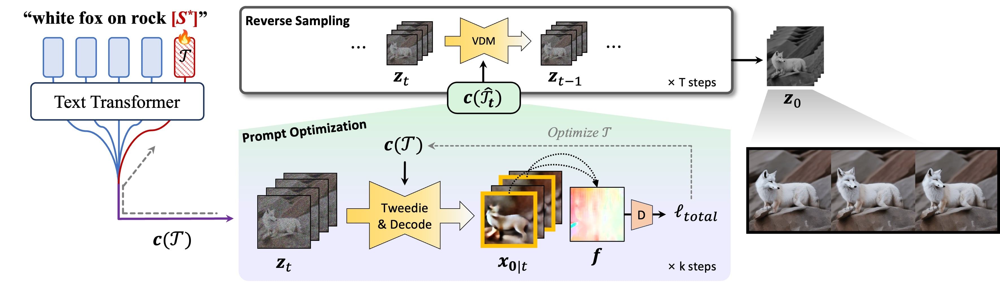

# Optical-Flow Guided Prompt Optimization for Coherent Video Generation (Motion Prompt)

This repository is the official implementation of Optical-Flow Guided Prompt Optimization for Coherent Video Generation,  
led by [Hyelin Nam](https://hyelinnam.github.io/)*, Jaemin Kim * , Dohun Lee, Jong Chul Ye

<!-- 
 -->

<table class="center">
  <tr>
    <td style="text-align:center;"><b>Baseline</b></td>
    <td style="text-align:center;" colspan="1"><b>Ours</b></td>
  </tr>
  <tr>
    <td></td>
    <td></td>
  </tr>
  <tr>
    <td></td>
    <td></td>
  </tr>
</table>

## Abstract
While text-to-video diffusion models have made significant strides, many still face challenges in generating videos with temporal consistency. Within diffusion frameworks, guidance techniques have proven effective in enhancing output quality during inference; however, applying these methods to video diffusion models introduces additional complexity of handling computations across entire sequences. To address this, we propose a novel framework called <b>MotionPrompt</b> that guides the video generation process via optical flow. Specifically, we train a discriminator to distinguish optical flow between random pairs of frames from real videos and generated ones. Given that prompts can influence the entire video, we optimize learnable token embeddings during reverse sampling steps by using gradients from a trained discriminator applied to random frame pairs. This approach allows our method to generate visually coherent video sequences that closely reflect natural motion dynamics, without compromising the fidelity of the generated content.

## Overview

  
 

MotionPrompt enhances temporal consistency in text-to-video diffusion models by combining prompt optimization with an optical flow-based discriminator. Leveraging gradients from a subset of frames and aligning optical flow with real-world motion patterns, MotionPrompt efficiently generates videos with smooth, realistic motion and strong contextual coherence.

